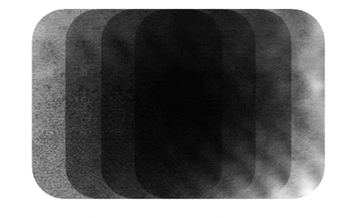

  

Abdelrahman Astro is a Telecom R&D engineer from Giza, Egypt. He got the B.Sc. Degree (distinction with honor) in Electrical Engineering from the Faculty of Engineering, Canadian International College in 2017 with the thesis titled "Cognitive Radio Network". Since late 2017, he has been working on celluler based open-source solution to study the possible non-profit implementation in rural and remote areas under the umbrella of UN for Sustainable Development Goals (SDGs). In 2018, he studied graduate courses at Scuola Superiori Sant'Anna and led a mmWave Radar project affilated with TeCIP institute, Sant'Anna. Now, he is going to join SnT - Interdisciplinary Centre for Security, Reliability and Trust at Luxembourg.

